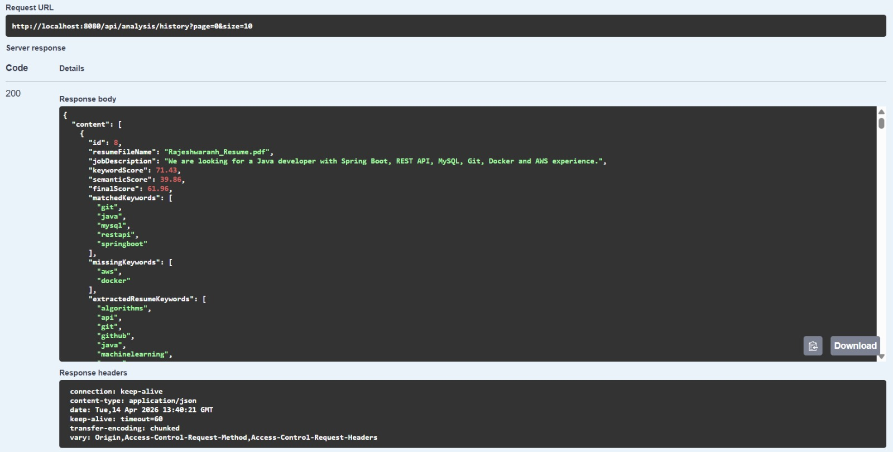
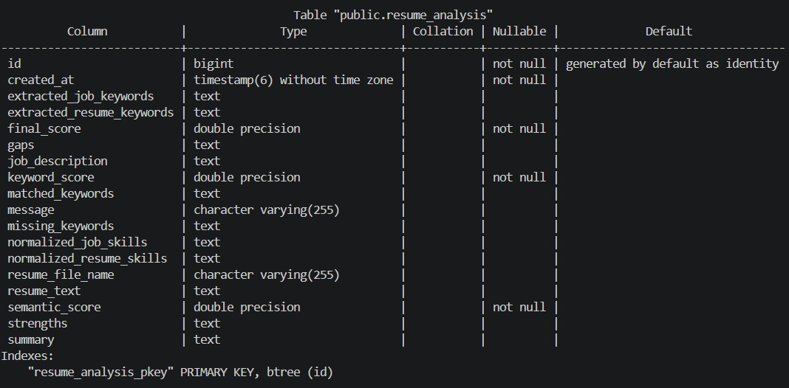
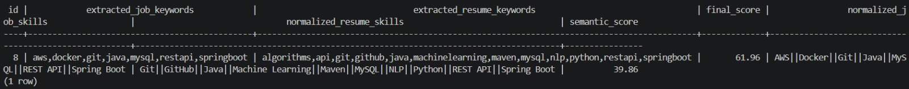

# 🚀 AI-Assisted Resume Analyzer

A full-stack application that analyzes resumes against job descriptions using a **hybrid scoring approach** that combines **keyword matching** and **semantic similarity**.  
It provides **final match scores**, **AI-assisted strengths and gaps**, and stores analysis history for later review.

---

## 🔍 What Problem This Solves

Recruiters and hiring teams often review large numbers of resumes for a single job role.

This project simulates a simplified resume screening workflow by:
- extracting relevant technical skills from resumes and job descriptions
- measuring keyword overlap
- computing semantic similarity using an AI service
- generating a hybrid final score
- highlighting strengths, missing skills, and an overall summary

---

## ⚙️ Key Features

- ⚡ Hybrid scoring system (**Keyword Score + Semantic Score + Final Score**)
- 🤖 AI-assisted insights (**strengths, gaps, and summary**)
- 📄 Analyze resume text directly
- 📂 Upload and analyze **PDF/TXT** resumes
- 💾 Persist analysis history in **PostgreSQL**
- 🔍 Search history by file name
- 🎯 Filter history by minimum final score
- 🌐 Full-stack architecture (**React + Spring Boot + FastAPI**)
- 📚 Swagger/OpenAPI documentation for backend APIs

---

## 🛠️ Tech Stack

### Frontend
- React (Vite)
- Axios
- Tailwind CSS

### Backend
- Java 25
- Spring Boot 4
- Spring Data JPA
- Maven
- Swagger / OpenAPI

### AI Service
- Python
- FastAPI
- Sentence Transformers
- Scikit-learn

### Database
- PostgreSQL
- Docker

---

## 🏗️ Architecture

```text
React Frontend
        ↓
Spring Boot REST API
        ↓
AI Service (FastAPI)
        ↓
Hybrid Scoring + Insights
        ↓
PostgreSQL Database
```

---
## Layer Responsibilities
- Frontend → User interface for analysis and history review
- Controller Layer → Handles HTTP requests
- Service Layer → Keyword extraction, scoring, orchestration, persistence
- AI Service → Semantic similarity, normalized skills, strengths, gaps
- Repository Layer → Database access
- Database → Stores analysis history and AI-assisted results

---

## 💻 Frontend UI

### 🔹 Homepage


---

### 🔹 Resume Analyzer (File Upload Result)


---

### 🔹 Analysis History Overview


---

### 🔹 History Filter (Min Score)


---

## 📷 Backend Proof

### 🔹 Swagger API Overview


### 🔹 Resume Analysis (Text Input)


### 🔹 Analysis History (Stored Data)



### 🔹 PostgreSQL Stored Records



### 🔹 PostgreSQL Stored Records Sample



---

## 📡 API Endpoints

### Resume Analysis
- POST /api/analysis/analyze-text
- POST /api/analysis/analyze-file

### Analysis History
- GET /api/analysis/history
- GET /api/analysis/history/id/{id}
- GET /api/analysis/history/search?fileName=...
- GET /api/analysis/history/filter?minScore=...

### Health
- GET /api/health

---

## 🧪 Example Request

### Analyze Resume Text

#### POST /api/analysis/analyze-text
```json
{
  "resumeText": "Java Spring Boot REST API MySQL Maven Git Docker",
  "jobDescription": "Looking for a Java developer with Spring Boot, REST API, MySQL, Git, Docker and AWS experience."
}
```

#### Example Response Shape

```json
{
    "keywordScore": 85.71,
    "semanticScore": 57.27,
    "finalScore": 77.18,
    "matchedKeywords": [
        "docker",
        "git",
        "java",
        "mysql",
        "restapi",
        "springboot"
    ],
    "missingKeywords": [
        "aws"
    ],
    "extractedResumeKeywords": [
        "docker",
        "git",
        "java",
        "junit",
        "maven",
        "mysql",
        "restapi",
        "springboot"
    ],
    "extractedJobKeywords": [
        "aws",
        "docker",
        "git",
        "java",
        "mysql",
        "restapi",
        "springboot"
    ],
    "normalizedResumeSkills": [
        "Docker",
        "Git",
        "JUnit",
        "Java",
        "Maven",
        "MySQL",
        "REST API",
        "Spring Boot"
    ],
    "normalizedJobSkills": [
        "AWS",
        "Docker",
        "Git",
        "Java",
        "MySQL",
        "REST API",
        "Spring Boot"
    ],
    "strengths": [
        "Good alignment in core technical skills",
        "Strong backend alignment with Java and Spring Boot",
        "Relevant database skills are present"
    ],
    "gaps": [
        "Some required or preferred skills are missing",
        "Cloud platform experience is not clearly shown"
    ],
    "summary": "Candidate shows a good overall match with the job description, with a notable strength in good alignment in core technical skills. Main gap: Some required or preferred skills are missing",
    "message": "Good Match"
}
```
---

## ⚙️ How to Run the Project

### 1️⃣ Clone the repository

```bash
git clone https://github.com/YOUR_USERNAME/resume-analyzer.git
cd resume-analyzer/backend
```

### 2️⃣ Start PostgreSQL using Docker
```bash
docker compose up -d
```

### Run the AI service

```bash
cd ai-service
python -m venv venv
venv\Scripts\activate
pip install -r requirements.txt
uvicorn app.main:app --host 127.0.0.1 --port 8001
```

### 3️⃣ Run the Spring Boot application
```bash
cd backend
./mvnw spring-boot:run
```

### 4️⃣ Run the Frontend
```bash
cd frontend
npm install
npm run dev
```

### Open
```
Frontend: http://localhost:5173
Backend Swagger UI: http://localhost:8080/swagger-ui/index.html
AI Service Docs: http://127.0.0.1:8001/docs
```

---

### Verified Functionality

The following flows were tested successfully:

- Resume text analysis
- Resume file analysis (PDF/TXT)
- Hybrid scoring response
- AI-assisted strengths, gaps, and summary
- History persistence in PostgreSQL
- History retrieval by ID
- Search by file name
- Filter by minimum final score
- Frontend integration with backend APIs

### 🚧 Limitations
- Resume parsing currently supports only PDF and TXT
- Semantic analysis is based on lightweight embeddings, not advanced ranking models
- No authentication or user accounts
- Candidate ranking across multiple resumes is not implemented yet
- AI insights are assistive and rule-guided, not recruiter-grade decision making

---

## 🧠 Future Improvements
- Better skill normalization and entity mapping
- Multi-resume candidate ranking
- DOCX resume parsing
- Authentication and user-specific history
- Cloud deployment for frontend, backend, AI service, and database
- Advanced recruiter feedback and recommendation engine
- Unit and integration test expansion

---

## 👤 Author

### Rajesh

⭐ If you like this project

Give it a star ⭐ on GitHub


---

## 🔥 Important things you must update

### 1. Replace GitHub URL
```bash
https://github.com/YOUR_USERNAME/resume-analyzer.git
```

### 2. Make sure screenshots exist here:
```bash
docs/screenshots/
```

If paths are wrong → images won’t show on GitHub.