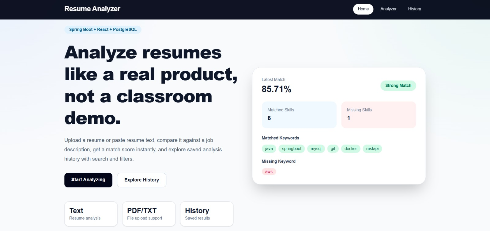
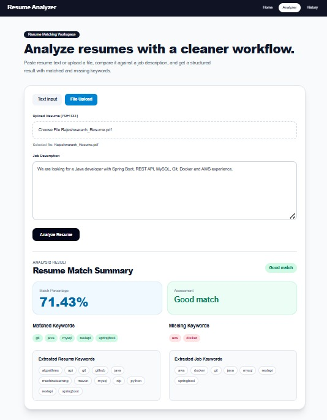
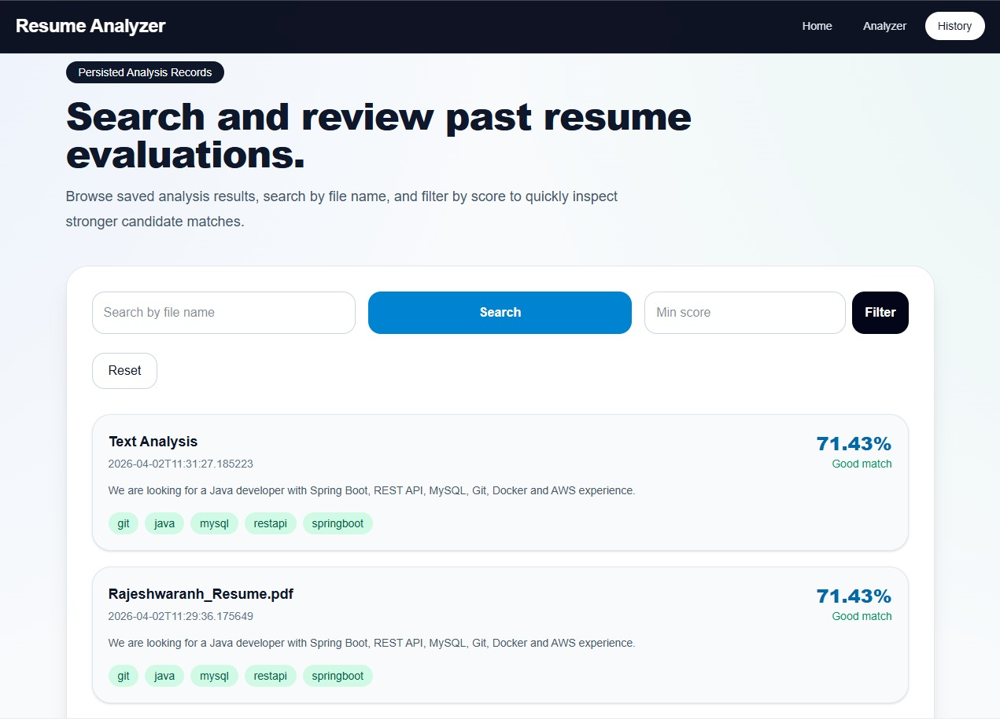
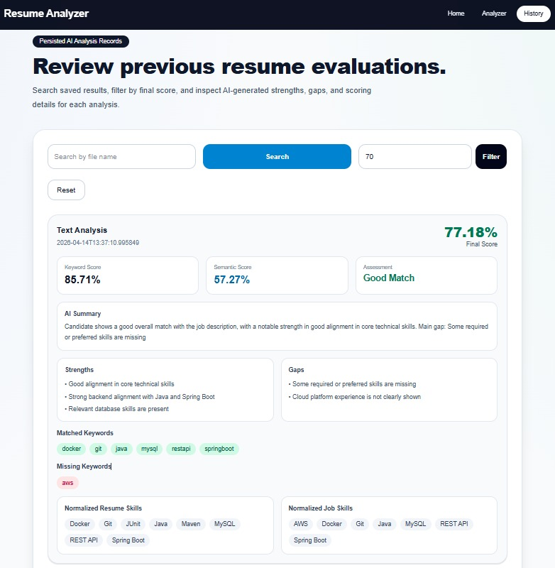
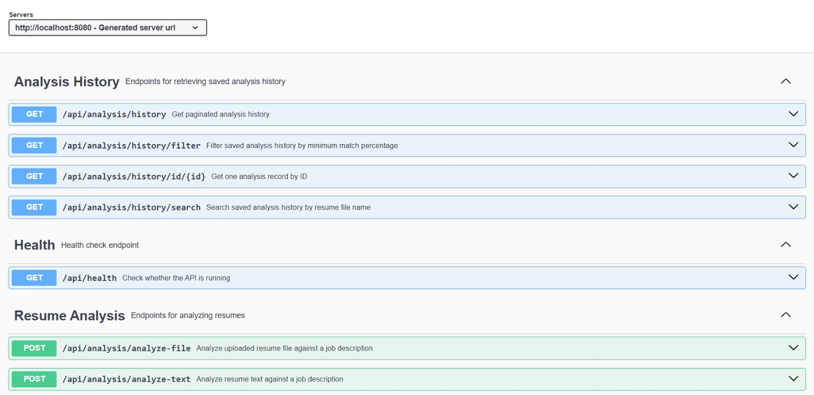
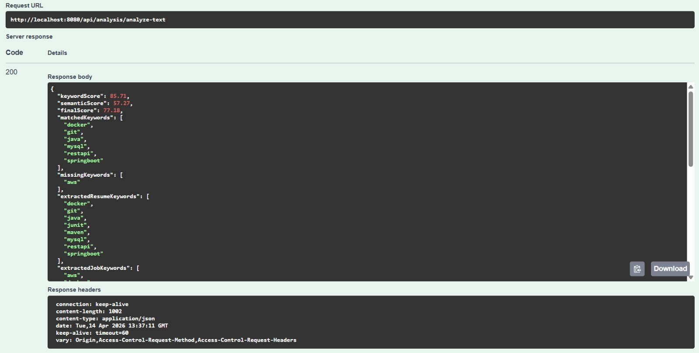
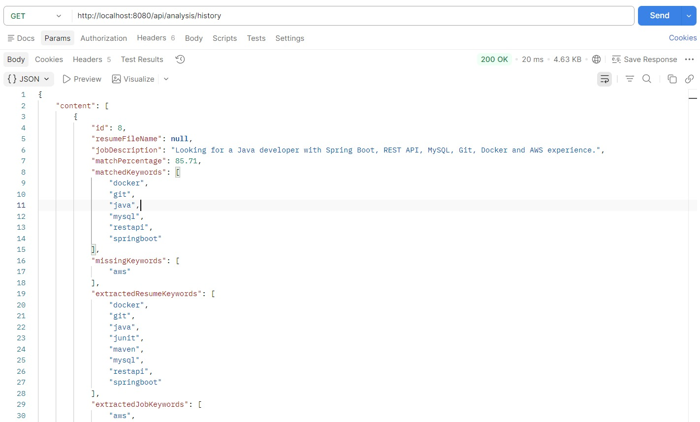
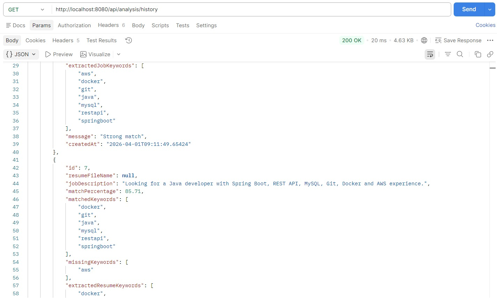
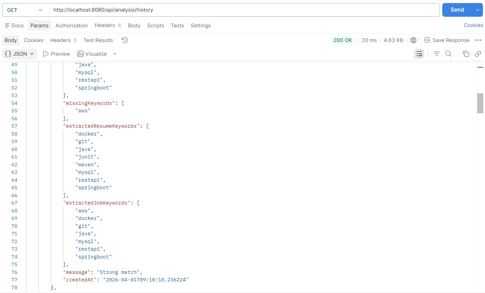
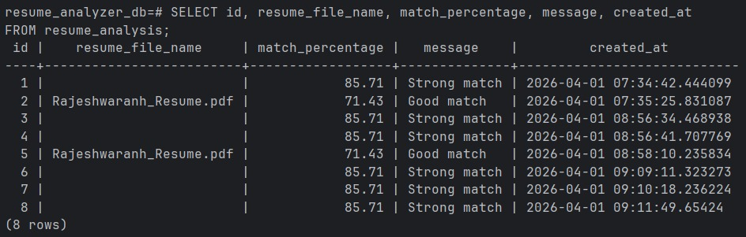

# 🚀 Resume Analyzer (Full-Stack)

A full-stack application that analyzes resumes against job descriptions using keyword extraction and match scoring.  
Supports file uploads, persistent storage, and interactive API exploration.

---

## 🔍 What Problem This Solves

Recruiters and hiring systems process hundreds of resumes for a single role.

This project simulates a simplified resume screening system by:
- extracting relevant technical keywords
- comparing them against job requirements
- computing a match score
- highlighting missing and matched skills

---

## ⚙️ Key Features

- 📄 Analyze resume text input  
- 📂 Upload and process PDF/TXT resumes  
- 🧠 Keyword extraction (skills, technologies)  
- 📊 Match percentage scoring  
- 💾 PostgreSQL persistence (via Docker)  
- 🔍 Search analysis history by file name  
- 🎯 Filter results by match score  
- 📚 Swagger API documentation  

---

## 🛠️ Tech Stack

### Backend
- Java 25  
- Spring Boot 4  
- Spring Data JPA  
- PostgreSQL (Docker)  
- Maven  
- Swagger (OpenAPI)  

### Frontend
- React (Vite)
- Axios
- Tailwind CSS

---

## 🏗️ Architecture

```text
React Frontend
        ↓
Spring Boot REST API
        ↓
Service Layer (Keyword Extraction + Scoring)
        ↓
PostgreSQL Database
```

---

- Controller Layer → Handles API requests
- Service Layer → Core logic (keyword extraction + scoring)
- Repository Layer → Database operations
- Database → Stores analysis history

---

## 💻 Frontend UI

### 🔹 Homepage


---

### 🔹 Resume Analyzer (File Upload Result)


---

### 🔹 Analysis History Overview


---

### 🔹 History Filter (Min Score)


---

## 📷 Backend Proof

### 🔹 Swagger API Overview



### 🔹 Resume Analysis (Text Input)



### 🔹 Analysis History (Stored Data)







### 🔹 PostgreSQL Stored Records



---

## 📡 API Endpoints

### Resume Analysis
- POST /api/analysis/analyze-text
- POST /api/analysis/analyze-file

### Analysis History
- GET /api/analysis/history
- GET /api/analysis/history/id/{id}
- GET /api/analysis/history/search?fileName=...
- GET /api/analysis/history/filter?minScore=...

### Health
- GET /api/health

---

## 🧪 Example Request

### Analyze Resume Text

#### POST /api/analysis/analyze-text
```json
{
  "resumeText": "Java Spring Boot REST API MySQL Maven Git Docker",
  "jobDescription": "Looking for a Java developer with Spring Boot, REST API, MySQL, Git, Docker and AWS experience."
}
```

---

## ⚙️ How to Run the Project

### 1️⃣ Clone the repository

```bash
git clone https://github.com/YOUR_USERNAME/resume-analyzer.git
cd resume-analyzer/backend
```

### 2️⃣ Start PostgreSQL using Docker
```bash
docker compose up -d
```

### 3️⃣ Run the Spring Boot application
```bash
./mvnw spring-boot:run
```

### 4️⃣ Run the Frontend
```bash
cd frontend
npm install
npm run dev
```

### Open
```
Frontend → http://localhost:5173
Swagger → http://localhost:8080/swagger-ui/index.html
```

---

### 🚧 Limitations
- Keyword-based matching (not semantic NLP)
- No authentication layer
- Limited resume parsing formats

---

## 🧠 Future Improvements
- Semantic NLP-based matching (embeddings / ML)
- Authentication (JWT)
- Resume parsing for DOCX
- Ranking multiple candidates
- Deployment (cloud + live demo)

---

## 👤 Author

### Rajesh

⭐ If you like this project

Give it a star ⭐ on GitHub


---

## 🔥 Important things you must update

### 1. Replace GitHub URL
```bash
https://github.com/YOUR_USERNAME/resume-analyzer.git
```

### 2. Make sure screenshots exist here:
```bash
docs/screenshots/
```

If paths are wrong → images won’t show on GitHub.